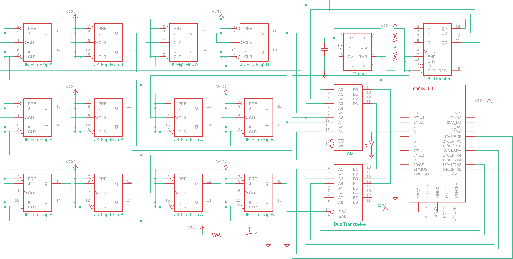

# MelodyRecorder
### Introduction
This digital electronics project uses Teensy 4.0 and allows the user to press buttons on a touchscreen to play and record a melody. After recording, the user may play back the melody.

### Components
- Teensy 4.0
- XPT2046 Touchscreen
- 2114 SRAM (R/W protocol in program is for MM2114N-3. Verify timing diagrams with other verisons before use)
- 74LVC245A Octal Bus Tranceiver (and means to supply 3.3V to it)
- Speaker
- LM555 Timer (Use $10 \; \mu F$ Capacitor and two $1500 \; \Omega$ resistors for 15ms pulse)
- 74LS161AN Synchronous 4-Bit Counter
- 6 x 74LS76A Dual JK Flip Flops
- Common Anode RGB LED
- Push Button

### How it Works
When the user presses START on the touchscreen, Teensy sends a HIGH voltage signal to Pin 14, which powers the LM555 timer. The Teensy also signals to the RAM and bus transceiver that write mode is enabled. The LM555, which has a period of 15 ms, acts as the clock a circuit that acts as a 10-bit counter. The 10 outputs connect to the address lines on the 1024x4 SRAM chip. When recording the melody, the Teensy sends a 4-bit string representing the current note and every 15 milliseconds writes to a new memory address in the RAM.
    
When the user selects PLAY, the only differences to the recording state are that Teensy outputs a Read signal instead of Write and the 4 I/O pins on the Teensy now receive input. The Read timing protocol for the 2114 RAM is followed, and the Teensy outputs received notes to the speaker.

After playing, the program erases the RAM by writing 0000 to every address. 

### Circuit Diagram
Note the wiring for the touchscreen is not included in the diagram. Wire your display in accordance to the pins specified in the .ino file.

### Picture of Circuit
